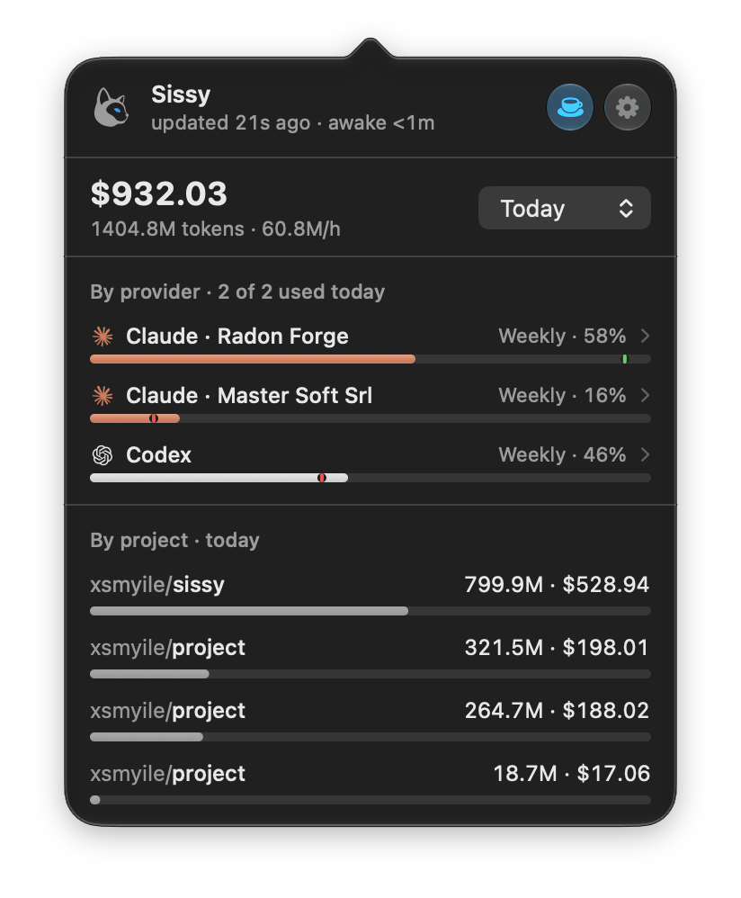
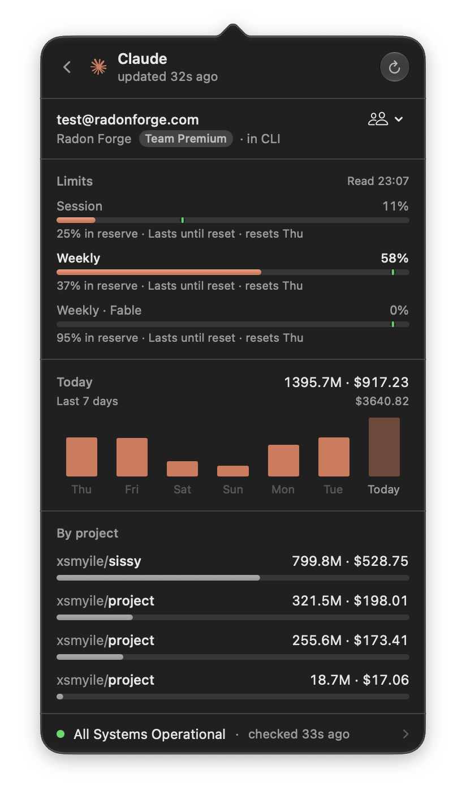
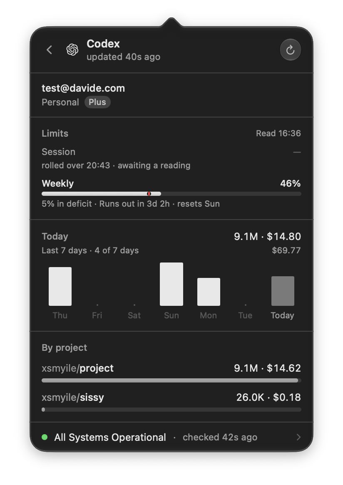

<div align="center">

<h1>
  <br />
  Sissy
</h1>

**The numbers you keep checking, in the macOS menu bar.**

Sissy reads what is already on your Mac and keeps the answer one click away, so
what you would otherwise open a browser or a terminal for sits behind one icon.
No API key, no account of its own, no telemetry, and nothing to grant at first
launch.

What it answers for today is what your coding agents cost: Claude Code and
Codex, priced as each turn lands, with the rate-limit pressure and the
per-repository split beside it.

[](../../releases/latest)
[](../../actions/workflows/ci.yml)
[](#install)
[](./LICENSE)

[Install](#install) • [What you see](#what-you-see) • [Supported CLIs](#supported-clis) • [Privacy](#privacy) • [Uninstall](#uninstall) • [How it works](#how-it-works) • [Configuration](#configuration) • [Build from source](#build-from-source)



</div>

## Why

A subscription hides the meter. A flat monthly fee tells you nothing about what
a day of agents actually cost, which account ate it, which repository it went
on, or how close you are to the rate limit that will stop your session mid-task.
The logs are already on disk, and the limits are one read away with the
credential the CLI already stored. Sissy reads both and puts the answer where
you will see it.

## Install

macOS 26 or later, Apple Silicon or Intel.

### Homebrew

```bash
brew install --cask xsmyile/sissy/sissy
```

`brew upgrade` keeps it current.

### Manual

Take the latest `Sissy-x.y.z.dmg` from [Releases](../../releases/latest), open
it, drag **Sissy** into Applications. The build is Developer ID signed and
notarized, so there is no `xattr` workaround and no right-click → Open.

Either way it starts tailing the moment it launches, and lives in the menu bar
rather than the Dock. **The first launch asks for nothing**: no Full Disk
Access, no keychain dialog, no prompt of any kind. That is a rule rather than a
list of what Sissy happens to need today. Anything that costs a permission, or
that writes outside Sissy's own folder, is off until you switch it on, asks at
that moment rather than at launch, and says what it will do before you flip it.
A module left off does not exist as far as the system is concerned.

## What you see

Sissy sits in the menu bar as herself. She blinks when usage lands and shuts
her eye when nothing is reaching the app, and that is the whole of the
peripheral signal: no number up there, nothing to read at a glance you did not
ask for. Click for the panel, right-click for the short menu.

### The Overview answers two questions

**What has this cost**, over a window you pick (`Today`, `7 days`, `30 days`,
`All`), with the tokens and the burn rate under it. The period is a popup on the
headline's own row, so the panel does not grow a section per timescale. Where
the archive does not go back as far as the window you asked for, a grey line
under the figure says how far it does go.

**Is there room to keep working.** One row per account, each carrying the
rate-limit window it will run out of *first*. That is a question about pace
rather than percentages: a session bucket at 40% that lasts until its reset
matters less than a weekly at 35% that empties in two days. The bar fills with
what has been spent, and the mark on it sits where even consumption would have
reached by now, so you can see you are ahead of pace instead of working it out.
Link a second Claude account and it gets its own row, because "am I about to be
cut off" has one answer per account.

Under that, where the day went **by repository**, not by directory. A worktree
counts against the repository it was cut from, so one project reads as one row
instead of eleven small ones.

<p align="center">
  
  
</p>

### A provider page per account

Click a row for everything about that one account: who it is signed in as and on
which plan, every rate-limit window it publishes with the time each resets, the
credit balance where the vendor reports one, its own day, and its own
repositories. The vendor's own status page is down there too, so "is it me or
them" costs no browser tab.

Click a repository for its card: the forge it is pushed to, a link to the page,
and the path on disk.

### Keep awake

The cup in the panel header stops the Mac idling to sleep under a running agent.
Three modes: *Never*, *While agents are working*, *Always*. The middle one is
the one no generic `caffeinate` can offer, because Sissy holds the Mac while
turns are landing and lets go ten minutes after they stop, so nothing has to be
switched back. *Always* stops after eight hours rather than going quiet. Neither
overrides closing the lid, and the hold lasts exactly as long as Sissy runs. Quit
and the Mac sleeps normally again, with nothing left behind to undo.

### Settings

**⌘,** or the gear in the panel. *General* is where start-at-login lives, along
with whether Sissy animates, whether the gauges print what is spent or what is
left, the session-hook switch, keep-awake, and the usage archive: where it sits,
an export, and a button that deletes it. *Providers* is each CLI's state, the
accounts linked to it, and the vendor status switch. *About* carries **Copy
diagnostics**, which is what an issue needs.

## Supported CLIs

| CLI | Reads | Reports |
|---|---|---|
| Claude Code | `~/.claude/projects/**/*.jsonl`, honoring `CLAUDE_CONFIG_DIR` | tokens, cost, per-repository split, every rate-limit window the account publishes, plan, credits |
| Codex | `~/.codex/sessions/**/rollout-*.jsonl`, honoring `CODEX_HOME` | tokens, cost, per-repository split, the windows the CLI reports, plan, credit balance |

Claude Code is always on; Codex is picked up whenever its session directory
exists. Either can be forced on or off from Settings ▸ Providers.

Two ceilings worth knowing about. Codex publishes its limits only on its own
turn events, so those gauges are always one turn behind. That is the shape of
the CLI, not a bug. Claude's limits come from the credential Claude Code already
stored, so they are as fresh as the last time that CLI ran; the refresh button
on the provider page re-reads it. That read costs no dialog either way: the
credential is a file in the CLI's own config directory, and where macOS keeps it
in the login keychain instead, Sissy reads it through `/usr/bin/security`, which
is already on that item's access list.

Adding a CLI that writes append-only JSONL is a `SourceAdapter` rather than a
second reader. See [`docs/ARCHITECTURE.md`](docs/ARCHITECTURE.md) and
[CONTRIBUTING.md](CONTRIBUTING.md).

## Privacy

Your session logs never leave the machine. Sissy reads them, prices them, and
renders a number. It listens on no port, has no account of its own, and does no
analytics and no crash reporting.

Everything it sends over the network is a reading you asked for, and each one
has a switch. As it stands there are four:

| Host | When | Why | Off switch |
|---|---|---|---|
| `raw.githubusercontent.com` | once a day | LiteLLM's public model price list | `remotePricing: false` pins pricing to the compiled-in snapshot and takes Sissy fully offline |
| `api.anthropic.com` | while Claude Code is metering | the usage and profile endpoints, with the OAuth token Claude Code already stored. Read-only, never refreshed, never written back | switch the Claude Code provider off |
| `claude.ai` | only for an account you linked yourself | that account's usage and credits | unlink the account |
| `status.claude.com`, `status.openai.com` | on a poll | each vendor's own public status page. No account, no credential, no identity | `statusChecks: false` |

**What Sissy reads on disk**, so there are no surprises: the two session-log
trees, the CLIs' own config files, and Claude Code's own OAuth token, which is
what the rate-limit windows come from. The token lives either in the CLI's
config directory or in the login keychain. Sissy never refreshes it, because
Anthropic's refresh tokens rotate on use and spending one would sign you out of
your own terminal, and never writes it except on an account switch you clicked.
The one place outside your home directory it reads today is Homebrew's `bin`,
and only when you press **Copy diagnostics**, to say which `ccusage` builds are
installed. [SECURITY.md](SECURITY.md) is the longer version.

**What Sissy keeps**: one day-by-model record under
`~/Library/Application Support/Sissy/history/`, so the panel can answer for more
than today. It holds totals, never prompts. Settings names the folder, deletes
it on a button, and `historyRetentionDays` bounds it, with `0` recording
nothing. On a first run Sissy fills that record in once from what the CLIs
already logged, so the wider windows are not empty for a month.

**Anything Sissy writes outside its own folder is off by default** and named
before you switch it on. There is one such switch, and one button that does the
same on the spot. The switch is *Name projects even when Sissy is off*; it adds
one line to `~/.claude/settings.json` and one to `~/.codex/hooks.json`, so a
session writes down which repository it is working
in while that directory still exists. Without it, work in a worktree deleted
while Sissy was not running counts towards no project at all. Switching it off
takes both lines and the script back out. The button is *Use in CLI*, which
writes the account you picked into the slot Claude Code reads its credential
from. Nothing else Sissy does touches it.

## Uninstall

```bash
brew uninstall --cask sissy
```

Or drag **Sissy** out of Applications. Either way the counting stops and the Mac
goes back to how it was: no daemon to kill, no power assertion still held,
nothing listening anywhere.

Three things survive on purpose, because they are the three Sissy was given
permission to keep:

- **The usage archive**, under `~/Library/Application Support/Sissy/`. Settings
  ▸ General deletes it on a button, or remove the folder yourself.
- **Archived Claude accounts**, if you ever pressed *Use in CLI*. They sit in a
  keychain item of Sissy's own; Settings ▸ Providers forgets them.
- **The session hooks**, if you ever switched *Name projects even when Sissy is
  off* on. Switch it back off **before** you uninstall and Sissy takes them out
  itself.

That last one is the only thing Sissy cannot clean up after the fact, so it is
worth saying plainly. Uninstall with the switch still on and two lines stay
behind: a `SessionStart` entry in `~/.claude/settings.json` and one in
`~/.codex/hooks.json`, both naming a `session-start.sh` that is no longer there.
They are inert — the shell finds no script, drains stdin and exits 0 — but they
are in two files that belong to other programs, and Sissy is gone and cannot
reach them. Delete the two entries by hand.

## How it works

The metering runs in a single process. Sissy watches the log directories,
prices each turn as it lands, and renders the combined reading. No daemon, no
socket, and nothing listening on a port. Counting happens while Sissy runs; the
numbers live in the CLIs' own files either way, so a relaunch resumes at the
byte it stopped at and loses nothing.
*Start at login* is what keeps a day complete.

There is no price table in the source. Rates come from
[LiteLLM](https://github.com/BerriAI/litellm)'s public price list, fetched at
runtime and cached for a day, with a generated snapshot compiled in as the
offline floor. A CLI that ships a new model therefore prices correctly without a
Sissy release. LiteLLM is also what [`ccusage`](https://github.com/ccusage/ccusage)
prices from, which is why the two agree on the same logs; CI asserts that
agreement on every engine change, and weekly regardless.

If Sissy and `ccusage` disagree on your machine, check `ccusage --version`
first: a Homebrew install pinned at 20.1.0 bills 1-hour cache writes at the
5-minute rate and will never upgrade off itself, which looks like Sissy
over-billing by about 7%.

## Configuration

Everything has a default and nothing has to be configured. The app writes
`~/Library/Application Support/Sissy/server.json`; the rows marked ▸ are also in
Settings.

| Key | Default | Effect |
|---|---|---|
| `providers` | auto-detect | force `claudeCode` / `codex` on or off ▸ |
| `claudeDataDir`, `codexDataDir` | `~/.claude/projects`, `~/.codex/sessions` | where to look |
| `statusChecks` | `true` | read each vendor's public status page ▸ |
| `keepAwake` | `off` | `auto` holds the Mac while agents are working and lets go after 10 minutes of silence; `on` holds it until you switch off, or for 8 hours ▸ |
| `keepScreenAwake` | `true` | whether that hold covers the screen too; `false` lets the display sleep and the Mac lock itself while the work carries on ▸ |
| `agentHooks` | `false` | register the `SessionStart` hook with both CLIs so a session names its repository ▸ |
| `historyRetentionDays` | `90` | days of day-by-model history kept under `history/`; `0` records none ▸ |
| `remotePricing` | `true` | fetch rates at runtime; `false` pins to the built-in snapshot |
| `pricingOverride` | none | per-model rates that win over both sources |
| `pollIntervalSeconds` | `60` | safety-net poll between filesystem events |

## Build from source

```bash
brew install xcodegen
cd app && xcodegen generate
xcodebuild -project Sissy.xcodeproj -scheme Sissy -configuration Debug build
```

Or, to run what you just built as a proper signed app:

```bash
scripts/dev-build-app.sh
```

It builds into `~/.cache/sissy/build-dev`, clears dev bundles other worktrees
left behind, and relaunches, so exactly one dev Sissy exists whichever branch
you are on. It keeps its own support directory, so it never disturbs an
installed copy. *Start at login* goes through `SMAppService`, which needs a
normally signed bundle: `CODE_SIGNING_ALLOWED=NO` is fine for CI, not for
testing that switch.

[CONTRIBUTING.md](CONTRIBUTING.md) has the rest: the linters, the self-test, and
what Sissy will and will not take. The
[code of conduct](CODE_OF_CONDUCT.md) applies to all of it.

## Credits

As it ships today, nothing third-party links into Sissy. Its reading of the
Claude Code and Codex log formats, and its pricing, follow
[`ccusage`](https://github.com/ccusage/ccusage);
the rates themselves come from [LiteLLM](https://github.com/BerriAI/litellm).
[CREDITS.md](CREDITS.md) says it properly.

Sissy is not affiliated with Anthropic, OpenAI, GitHub or GitLab, and none of
them endorses it. Their marks appear only to say which CLI a row is about and
where a repository is pushed.

## The name

Named after my cat: she naps, judges, demands cuddles (A LOT of cuddles), and
is, objectively, fabulous. The icon is her.

## License

The source code is [MIT](./LICENSE). Sissy's name and her artwork are not, and
[NOTICE](./NOTICE) says what that means. Fork it, ship it, sell it; just not
wearing her face.
