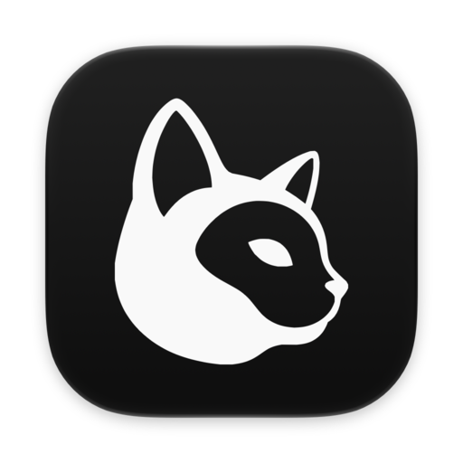
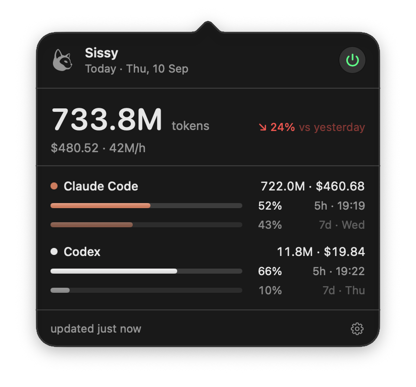

<div align="center">



# Sissy

**Today's AI coding spend, in your macOS menu bar.**

Sissy tails the session logs your AI CLIs already write, sums the day across all of them, and keeps tokens, cost and rate-limit headroom one click away. No API key, no account, no telemetry.

[](../../releases/latest)
[](#install)
[](./LICENSE)

[Install](#install) • [What you see](#what-you-see) • [Supported CLIs](#supported-clis) • [How it works](#how-it-works) • [Configuration](#configuration) • [Build from source](#build-from-source)

</div>

## Why

Subscription plans hide the meter. A flat monthly fee tells you nothing about what a day of agents actually cost, which CLI ate it, or how close you are to the rate limit that will stop your session mid-task. The numbers are already on disk. Sissy reads them and puts them where you'll see them.

## Install

macOS 26 or later, Apple Silicon or Intel.

### Homebrew (recommended)

```bash
brew install --cask xsmyile/sissy/sissy
```

`brew upgrade` keeps it current.

### Manual

Grab the latest `Sissy-x.y.z.dmg` from [Releases](../../releases/latest), open it, and drag **Sissy** into Applications.

Either way: launch Sissy and it starts tailing. It lives in the menu bar — no dock icon, no window — and asks for nothing on first run. The build is Developer ID signed and notarized, so there's no `xattr` workaround and no right-click → Open.

## What you see

The menu bar carries today's token total. Click it for a panel with

- the running total and what it has cost so far,
- the swing against yesterday,
- one row per CLI with its tokens and cost, carrying either a gauge per rate-limit window and the time it resets, or, for a CLI that reports no limits, its share of the day.

The cup beside the panel's power button is **keep awake**: switch it on and the Mac stops idling to sleep under a running agent. It lights the same way the power button does, and the mode is remembered until you switch it off — including across a restart. It does not override closing the lid, and the hold lasts only while Sissy is running: quit and the Mac sleeps normally again.

Right-click for the short menu; **Settings…** (⌘,) holds *Start at login* and the Claude Code limits opt-in.

<p align="center">
  
</p>

## Supported CLIs

| CLI | Reads | Tracks |
|---|---|---|
| Claude Code | `~/.claude/projects/**/*.jsonl` | tokens, cost, 5-hour and weekly subscription windows (opt-in) |
| Codex | `~/.codex/sessions/**/rollout-*.jsonl`, honoring `CODEX_HOME` | tokens, cost, the rate-limit windows the CLI reports |

Claude Code is always on. Codex is picked up whenever its session directory exists. Force either one on or off with `providers` in `server.json`. Every active CLI gets its own row in the panel.

Codex reports its limits only on its own turn events, so those gauges are always one turn behind. Claude Code's come from an opt-in read of the token the CLI already stored; until you enable it, the panel shows cost and tokens only.

Adding a CLI is one `UsageProvider` implementation. See [`docs/ARCHITECTURE.md`](docs/ARCHITECTURE.md).

## How it works

Sissy is one process. It watches the log directories, prices each turn as it lands, and renders the combined reading — no helper, no socket, no port. Counting runs while Sissy runs; the numbers live in the CLIs' own log files either way, so a relaunch picks up exactly where it left off. Switch on **Start at login** if you want a day counted from the moment you sit down.

There is no price table in the source. Rates come from [LiteLLM](https://github.com/BerriAI/litellm)'s public price list, fetched at runtime and cached for a day, with a snapshot compiled in as the offline floor. A CLI that ships a new model therefore prices correctly without a Sissy release. It is also the source [`ccusage`](https://github.com/ccusage/ccusage) reads, which is why the two agree on the same logs. CI asserts it on every change to the engine, and weekly regardless.

## Privacy

Your session logs never leave the machine; Sissy reads them and renders a number. It listens on no port and makes exactly two kinds of outbound request:

- LiteLLM's price list on `raw.githubusercontent.com`, once a day;
- `api.anthropic.com/api/oauth/usage`, only with Claude Code limits enabled, using the OAuth token the CLI already stored, read-only, never refreshed, never written back.

Sissy keeps one record of its own: a day-by-model tally under `~/Library/Application Support/Sissy/history/`, so the panel can show more than today. It is the totals, not your prompts — Settings ▸ General names the folder and deletes it, and `historyRetentionDays` bounds how far back it goes.

No analytics, no crash reporting, no account.

## Configuration

The app writes `~/Library/Application Support/Sissy/server.json`; every key is optional.

| Key | Default | Effect |
|---|---|---|
| `providers` | auto-detect | force `claudeCode` / `codex` on or off |
| `claudeDataDir`, `codexDataDir` | `~/.claude/projects`, `~/.codex/sessions` | where to look |
| `claudeLimits` | `false` | read the CLI's OAuth token to show the 5-hour and weekly windows |
| `keepAwake` | `off` | `auto` holds the Mac while agents are working and lets go after 10 minutes of silence; `on` holds it until you switch off, or for 8 hours — a closed lid sleeps anyway |
| `keepScreenAwake` | on | whether that hold covers the screen too; `false` lets the display sleep and the Mac lock itself while the Mac stays awake |
| `remotePricing` | on | fetch rates at runtime; `false` pins to the built-in snapshot and goes fully offline |
| `pricingOverride` | none | per-model rates that win over both sources |
| `historyRetentionDays` | `90` | days of the day-by-model history kept under `history/`; `0` records none, and deleting what is there is the button in Settings |
| `pollIntervalSeconds` | `60` | safety-net poll between filesystem events |

## Build from source

```bash
scripts/dev-build-app.sh
```

The script builds into `~/.cache/sissy/build-dev`, removes dev bundles left by
other worktrees or by a plain `xcodebuild`, and relaunches the result, so
exactly one dev app exists no matter which branch you build. Pass
`RELAUNCH=0` to skip the relaunch.

**Start at login** goes through `SMAppService`, which requires a normally signed app build: `CODE_SIGNING_ALLOWED=NO` is fine for CI but not for testing that switch locally.

## Credits

Usage parsing follows [`ccusage`](https://github.com/ccusage/ccusage): both the JSONL schemas (Claude Code and Codex rollouts) and per-model pricing come from there.

## The name

Named after my cat: she naps, judges, demands cuddles (A LOT of cuddles), and is, objectively, fabulous. The icon is her.

## License

[MIT](./LICENSE). Sissy links no third-party code; the projects it reads from are credited in [CREDITS.md](./CREDITS.md).
