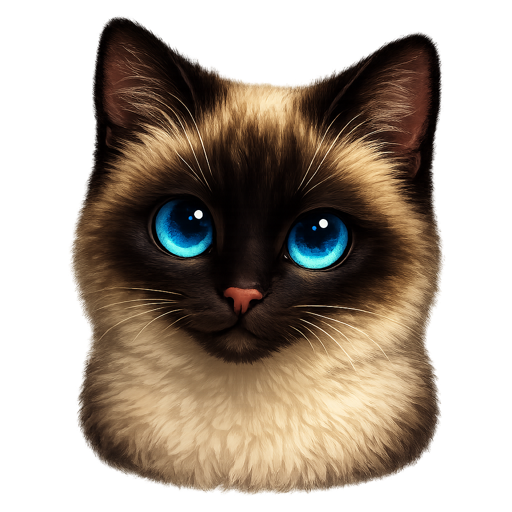
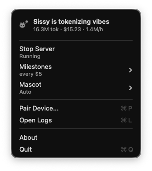
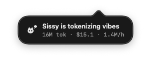

<div align="center">



# Sissy

A menubar companion for **Claude Code** and **Codex**.

Sissy watches your token meter and gets moodier the more you spend.

Named after my cat: she naps, judges, demands cuddles (A LOT of cuddles), and is, objectively, fabulous.

[Install](#install) • [Demo](#demo) • [How it works](#how-it-works) • [Build from source](#build-from-source) • [Desk companion](#desk-companion)

_Status: alpha._

</div>

## Install

macOS 26+ on Apple Silicon or Intel.

### Homebrew (recommended)

```bash
brew install --cask xsmyile/sissy/sissy
```

`brew upgrade` keeps it current.

### Manual

Grab the latest `Sissy-x.y.z.dmg` from [Releases](../../releases/latest), open it, and drag **Sissy** into Applications.

Either way: launch Sissy (it lives in the menubar), then **Start Server** to begin tailing token usage. The build is Developer ID signed and notarized, so there's no `xattr` workaround and no right-click → Open.

## Demo

A cat sits in your menubar and keeps the day's spend one click away.

Click the icon for a panel with the running total, the day-over-day delta, the next milestone, and a per-CLI split in each vendor's own colour:

<p align="center">
  
</p>

When the mood shifts, a small popover slides in with Sissy's current vibe:

<p align="center">
  
</p>

## How it works

A small daemon on your Mac tails each supported CLI's session log, sums the day's spend across all of them, and shows the combined total in the menubar.

Currently supports Claude Code (`~/.claude/projects/`) and Codex (`~/.codex/sessions/`, also honors `CODEX_HOME`). Codex is tracked whenever its session directory exists; force it on or off via `providers` in `~/Library/Application Support/Sissy/server.json`. Every active CLI gets its own row in the panel with that day's split.

## Build from source

```bash
scripts/dev-build-app.sh
```

The script builds into `~/.cache/sissy/build-dev`, removes dev bundles left by
other worktrees or by a plain `xcodebuild`, and relaunches the result — so
exactly one dev app exists no matter which branch you build. Pass
`RELAUNCH=0` to skip the relaunch.

Menubar → **Server** toggles the bundled LaunchAgent. When switched on it registers the daemon so it restarts on login; turning it off unregisters the agent. That control requires a normally signed app build. `CODE_SIGNING_ALLOWED=NO` is fine for CI but not for testing Server start/stop locally.

## Credits

Usage parsing follows [`ccusage`](https://github.com/ryoppippi/ccusage): both the JSONL schemas (Claude Code and Codex rollouts) and per-model pricing come from there. The daemon's WebSocket server is [SwiftNIO](https://github.com/apple/swift-nio).

## License

[MIT](./LICENSE).
